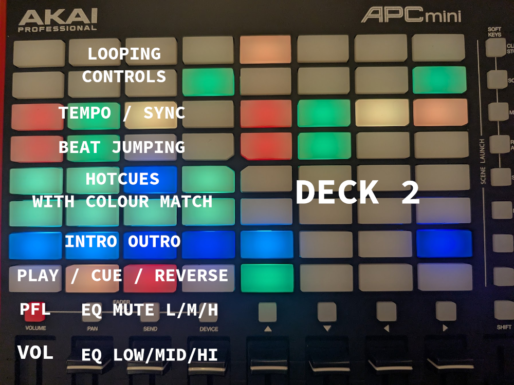

# [Mixxx](https://www.mixxx.org/) controller mappings (and stuff) for Akai products (I own and use)

This is my collection of mappings for Mixxx for Akai products. Currently, I have mappings for the
[**APC mini mk2**](apc-mini/MAPPING.md) and the [**MIDI mix**](midi-mix/midi-mix-4-decks.midi.xml).

I use the **APC** most of the time:

## Documentation on the controllers

As the [Akai product download page](https://www.akaipro.com/downloads-and-support/downloads/) does not provide
information on the MIDI mapping for the **MIDI mix**, I have added it [here](midi-mix/CONTROLLER.md).

My version of the **APC Mini mk2** [documentation](apc-mini/CONTROLLER.md) is also a bit more detailed than the official
one.

## Tools

So far, I added only [one little tool](apc-mini/colours.sh) to show the built-in colours of the APC mini mk2 (at full
brightness).
